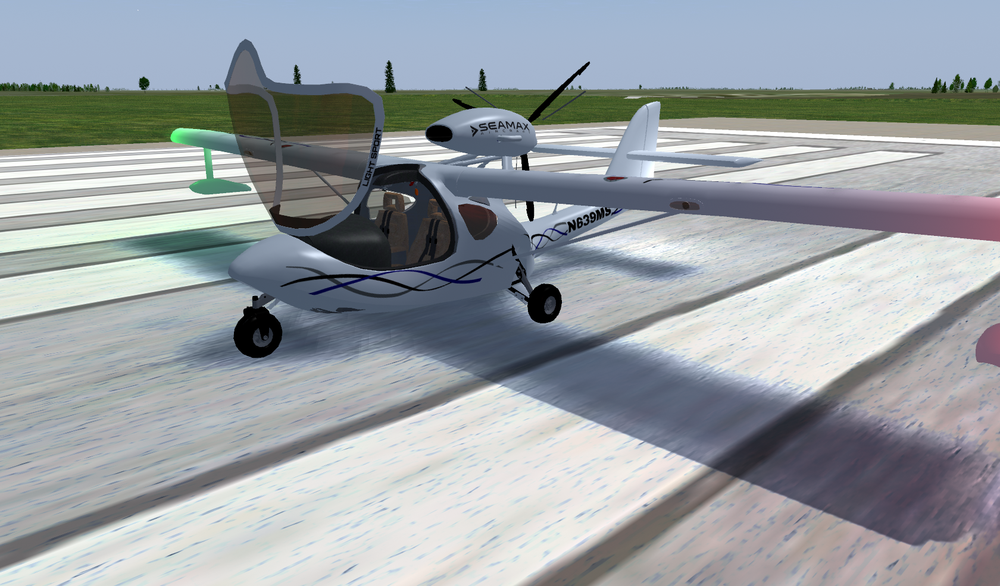
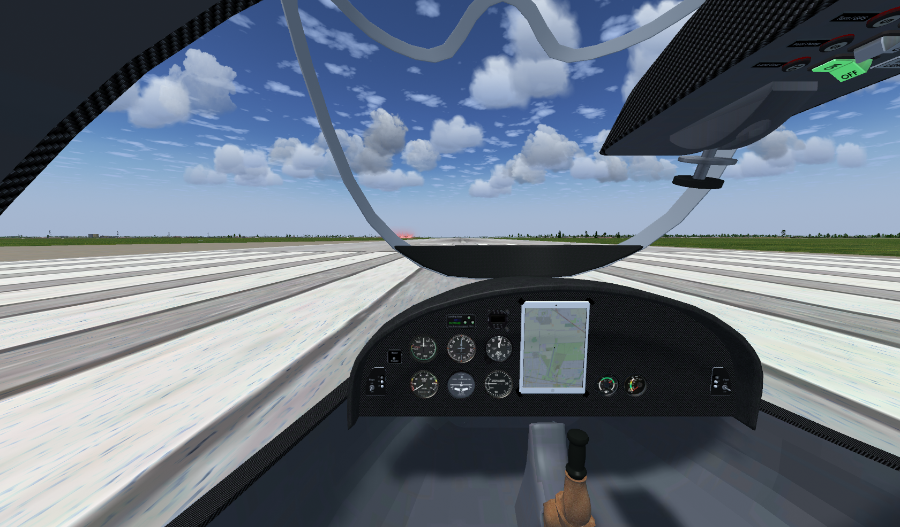

Seamax M-22
=========

SeaMax M-22 aircraft for FlightGear

 

Currently under heavy development.
 
Has both JSBSim and YaSim configurations, but current development is focused mainly on JSBSim.

Features
========
- Rotax 912 ULS with accurate performance/temperature curves.
- Fuel system simulation with both mechanical and electric pump working according to POH.
- Retractable gears.
- Can take off and land on solid surfaces or water.
- Water rudder to enhance low-speed handling.
- Complete electric system with circuit breakers.
- Landing, strobes and nav lights.
- Can stand on jacks (<kbd>shift</kbd>+<kbd>j</kbd> to toggle) for landing gear testing on ground!

Author: Julio Santa Cruz (bartacruz@gmail.com)
Licensed under [GPL-2.0](COPYING).

